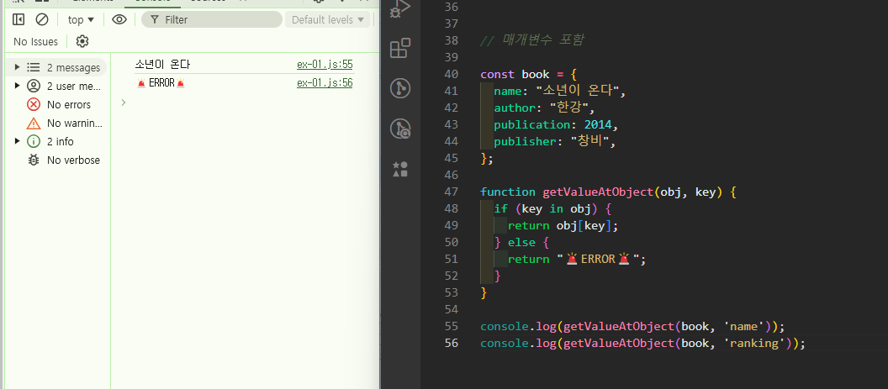

# 🐯 JS Homework 01 🐯

## Mission-01

### ✏️문제
**객체에서 특정 키의 값을 안전하게 가져오는 함수를 작성하세요.**

**설명:** 객체와 키를 인수로 받아, 객체에 해당 키가 존재하면 그 키에 해당하는 값을 반환하고, 존재하지 않으면 에러를 발생시키는 함수를 작성하세요.

### 제공된 함수 시그니쳐와 예시

- 함수 시그니쳐
```js
function getValueAtObject(obj, key) {
  // 코드를 작성하세요
}
```

- 코드 예시
```js
const person = {
  name: 'Alice',
  age: 25,
  city: 'Wonderland'
};

console.log(getValueAtObject(person, 'name')); // 'Alice'
console.log(getValueAtObject(person, 'age'));  // 25
console.log(getValueAtObject(person, 'city')); // 'Wonderland'
console.log(getValueAtObject(person, 'country')); // Error !
```
</br>

### 첫 번째 접근
첫 번째 접근은 함수 시그니쳐에서 주어진 매개변수들을 까먹고 아래 코드와 같이 if문으로 작성했었다. 

```js
const book = {
  name: "소년이 온다",
  author: "한강",
  publication: 2014,
  publisher: "창비",
};

function getValueAtObject() {

  let objectName = prompt("찾고자 하는 객체의 이름을 입력해주세요");

  if (objectName.toLowerCase() === "book") {
    let keyName = prompt("해당 객체에서 찾고 싶은 키 값의 이름을 입력해주세요");
    
    if (keyName.toLowerCase() === "name") {
      alert("책 이름은 '소년이 온다' 입니다.");
    } else if (keyName.toLowerCase() === "author") {
      alert("작가님 성함은 '한강' 입니다.");
    } else if (keyName.toLowerCase() === "publication") {
      alert("출판년도는 2014년 입니다.");
    } else if (keyName.toLowerCase() === "publisher") {
      alert("출판사는 '창비'입니다. ");
    } else {
      alert("🚨ERROR🚨");
    }
  } else {
    alert("🚨ERROR🚨");
  }
}

getValueAtObject();
```
</br>

```js
let objectName = prompt("찾고자 하는 객체의 이름을 입력해주세요");
``` 
우선 찾고자 하는 객체를 `prompt`를 이용하여 입력을 받고,

```js
 if (objectName.toLowerCase() === "book") {
    let keyName = prompt("해당 객체에서 찾고 싶은 키 값의 이름을 입력해주세요");
    
    if (keyName.toLowerCase() === "name") {
      alert("책 이름은 '소년이 온다' 입니다.");
    } else if (keyName.toLowerCase() === "author") {
      alert("작가님 성함은 '한강' 입니다.");
    } else if (keyName.toLowerCase() === "publication") {
      alert("출판년도는 2014년 입니다.");
    } else if (keyName.toLowerCase() === "publisher") {
      alert("출판사는 '창비'입니다. ");
    } else {
      alert("🚨ERROR🚨");
    }
  } else {
    alert("🚨ERROR🚨");
  }
  ```
  그 객체가 `'book'`이 맞을땐 내부의 if문으로 한 번 더 들어갔다. 내부의 if 문에서는 `prompt`를 이용하여 해당 객체에서 찾고싶은 키 값을 입력 받았고, 해당 키 값을 바탕으로 `'book'` 객체의 `key` 값을 반환하였다. 

  `key`값이 해당 객체에 없는 값이면 `error`를 반환하도록 하였다.

  이 때 객체의 이름과 `key` 값 모두 입력 받은 값을 비교할 때 `toLowerCase()`메소드를 활용하여 대소문자 관계 없이 비교 가능하도록 하였다.

  그리고 첫 번째 if문인 찾고자 하는 객체가 `'book'`이 아니면 이 또한 에러를 반환하도록 하였다.

</br>

### 하지만!
뒤 늦게 함수 시그니쳐를 다시 확인하고 매개변수가 있다는 사실을 깨달았다...
그리고, 예시 코드를 보니 객체가 `book`이 맞는지는 굳이 확인을 하지 않아도 된다는 사실을 알았다. 그래서 다시 한번 코드를 작성해보았다.


---

</br>

### 두번째 접근

매개변수를 활용하여 코드를 작성하니 훨씬 짧아졌다 \^___^


```js
const book = {
  name: "소년이 온다",
  author: "한강",
  publication: 2014,
  publisher: "창비",
};

function getValueAtObject(obj, key) {
  if (key in obj) {
    return obj[key];
  } else {
    return "🚨ERROR🚨";
  }
}

console.log(getValueAtObject(book, 'name')); 
console.log(getValueAtObject(book, 'ranking')); 
```

</br>

함수의 내용을 확인해보자면
```js
function getValueAtObject(obj, key) {
  if (key in obj) {
    return obj[key];
  } else {
    return "🚨ERROR🚨";
  }
}
```
만약 `key` 값이 `obj` 내부에 있다면 해당 `obj`에 `key`값을 반환하도록 하였고, `key` 값이 `obj` 내부에 없다면 에러를 반환하도록 하였다.

여기서 키 값이 객체 내부에 있는지 없는지를 확인 하는 메소드를 세 가지 정도를 고민하였다.
`in`, `hasOwn`, `hasOwnProperty`

가장 큰 차이점으로는 `in`은 객체에 직접 정의된 속성뿐만 아니라 상속된 속성도 확인한다는 것 이었고 `hasOwn`과 `hasOwnProperty`는 객체에 직접 정의된 속성만을 확인하였다.

그래서 처음에는 `hasOwn`이나 `hasOwnProperty`를 사용하려고 하였으나 

`hasOwnProperty`는 객체에 같은 이름을 가진 키값이 있다면 오버라이드 될 위험이 있습니다. 그래서 사용하지 않았고 이런 문제를 해결하기 위해 ES2022에 나온게 `hasOwn`이라고 하였습니다. 하지만 `hasOwn`은 아직 최신 브라우저에만 적용이 된다는 것을 알게되어서 지금 만드는 함수는 상속도 하지 않는 간단한 함수이니 이번 함수에는 `in`을 사용하였습니다.

## Mission-01 결과

결과는 위와 같이 잘 출력 되었다.


</br>
</br>
</br>
</br>

---

## Mission-02

### ✏️문제
**배열에서 특정 인덱스의 값을 안전하게 가져오는 함수를 작성하세요.**

**설명**: 배열과 인덱스를 인수로 받아, 인덱스가 배열의 유효한 범위 내에 있으면 그 인덱스에 해당하는 값을 반환하고, 유효하지 않은 인덱스일 경우 에러 메시지를 반환하는 함수를 작성하세요.

### 제공된 함수 시그니쳐와 예시

- 함수 시그니쳐
```js
function getNumberAtArray(arr, index) {
  // 코드를 작성하세요
}
```
- 코드 예시
```js
const numbers = [10, 20, 30, 40, 50];

console.log(getNumberAtArray(numbers, 2)); // 30
console.log(getNumberAtArray(numbers, 4)); // 50
console.log(getNumberAtArray(numbers, 5)); // Error!
console.log(getNumberAtArray(numbers, -1)); // Error!
```
</br>

### 문제 풀이


- **문제 확인**
이번 문제는 위 문제에서 크게 '배열'이라는 조건이 달랐다.


**작성코드**

```js
const numbers = [1, 2, 3, 4, 5, 6, 7, 8, 9];


function getNumberAtArray(arr, index) {
  if (0 <= index && index < arr.length) {
    return arr[index]
  } else {
    return "🚨ERROR🚨";
  }
}


console.log(getNumberAtArray(numbers, 8)); 
console.log(getNumberAtArray(numbers, 0)); 
console.log(getNumberAtArray(numbers, 9)); 
console.log(getNumberAtArray(numbers, 55)); 
console.log(getNumberAtArray(numbers, -1)); 
```

우선 배열과 인덱스를 인수로 받아, 인덱스가 배열의 유효한 범위 내에 있으면 그 인덱스에 해당하는 값을 반환해야했기 때문에 '인덱스가 배열의 유요한 범위 내에 있는지'가 중요한 조건이었다. 

```js
  if (0 <= index && index < arr.length) {
    return arr[index]
  } else {
    return "🚨ERROR🚨";
  }
```
그리하여 작성한 if문. if문의 조건을 설명해보자면 

우선 배열의 인덱스는 0부터 시작되고, 그렇기 때문에 인덱스 번호는 (배열의 길이 -1)만큼이다. 즉 `num = [10, 20, 30]` 이런 배열이 있다면 인덱스 번호는 `10 = 0, 20 = 1, 30 = 2`라는 뜻 이다.

그렇기 때문에 매개변수로 입력 받은 `index`값은 0보다 크거나 같고, 배열의 길이인 `arr.length`보다 작은 범위 내에 있다면 올바른 범위에 있는 인덱스라고 할 수 있었다.
이 조건 안에 있는 `index`는 `return arr[index]` 코드로 배열에서 해당 인덱스 번호의 값을 리턴해주었다. 
만약 해당 범위에 있지 않은 `index` 값이라면 에러를 반환해주었다.

## Mission-02 결과

결과는 위와 같이 잘 출력 되었다.

</br>
</br>

## ⭐ 느낀점
문제만 봤을 땐 짧은 함수니까 금방 구현할 수 있을 줄 알았는데 생각보다 직접 함수를 작성해보려고하니 어려웠다. 

특히 맨 처음이 어려웠다. 함수를 작성하려면 무엇부터 고려하고 어떤 내용부터 작성해야하는지 맨 화면에서 막막했다. 함수 시그니쳐가 없었다면 정말 갈피를 못 잡았을 수도 있었을 것 같다는 생각을 했다. 

이 문제는 함수를 좀 더 많이 작성해보다보면 나아지겠지 생각했다 \:-)

그리고 특히 첫 번째 함수를 작성했을 때 매개변수를 사용하지 않았을 땐 if문을 사용하여 작성하였는데 코드 작성 길이 차이가 꽤 나서 신기했다. 물론 객체 자체를 비교하는 코드를 추가하기도 해서 길어진 것도 있지만.

앞으로도 이렇게 수업을 듣고 직접 코드를 작성해보는 연습을 해보면 부족한 점도 많이 알 수 있고 좋을 것 같다는 생각을 했다!