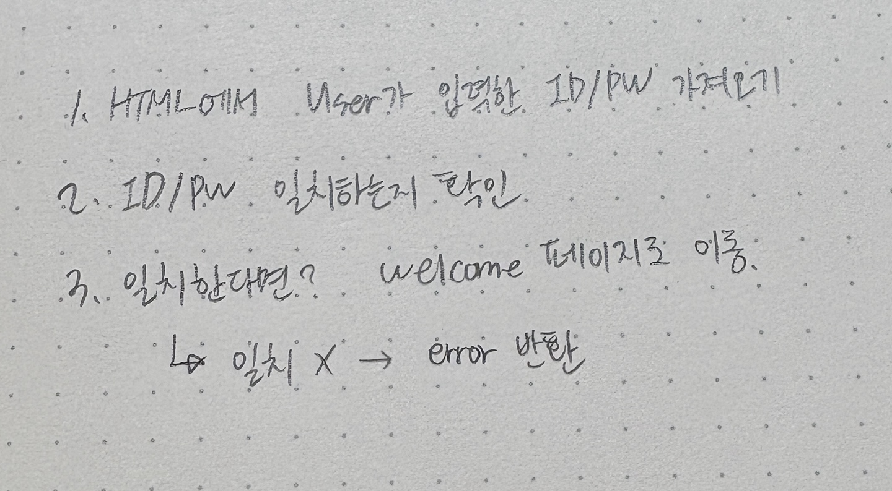
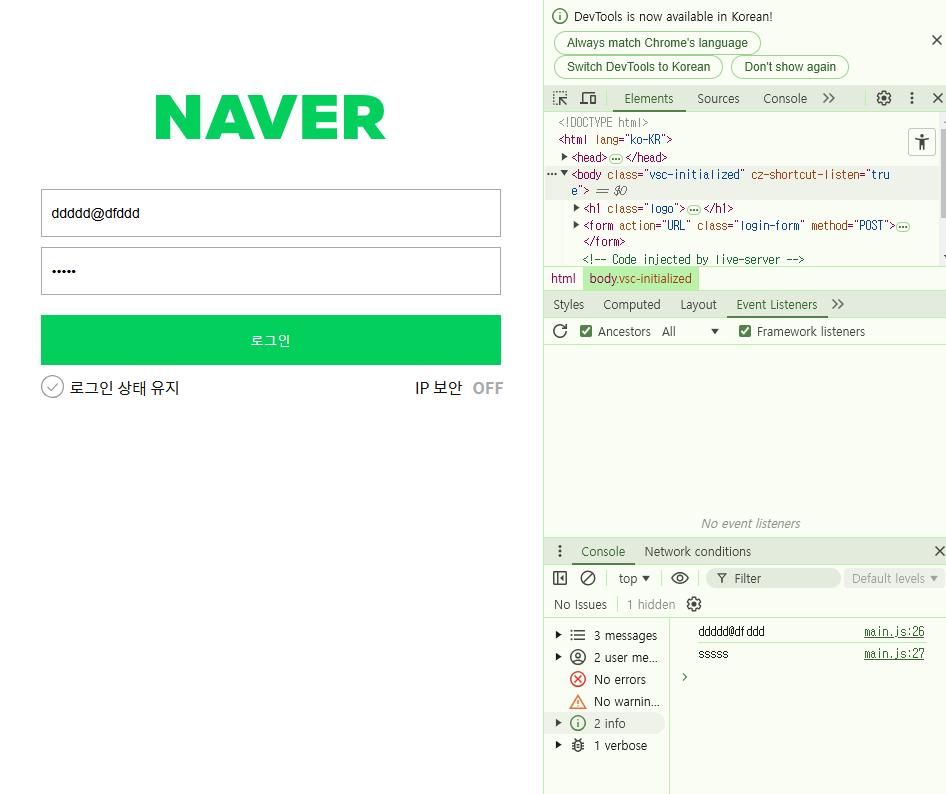
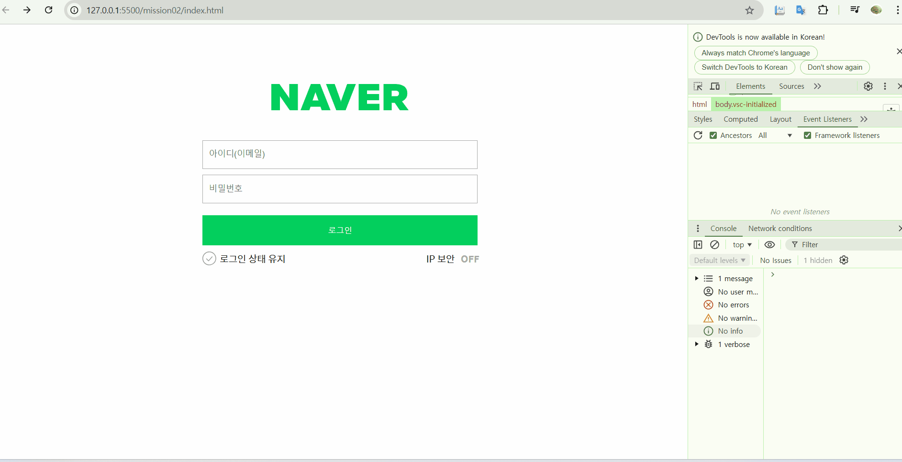

# 🐯 JS Homework 02 🐯

## Mission-02

### ✏️문제
**일치하는 아이디와 비밀번호를 입력했을 경우 welcome 페이지로 이동하는 코드 로직을 작성해주세요.**

**설명:** 로그인 페이지에서 user가 id와 password를 입력했을 때 미리 설정해둔 id/pw와 일치하는 값을 입력한 경우 'welcome' 페이지로 이동하는 코드 로직을 작성하세요.


### 요구사항

1. email 정규표현식을 사용한 조건처리 
```html
 //   - false면 해당 input에 is--invalid 추가
			node.classList.remove('is--invalid')
//  - true면 해당 input에 is--invalid 제거
			node.classList.add('is--invalid')
```
​
2. pw 정규표현식을 사용한 validation
```html
//   - false면 해당 input에 is--invalid 추가
			node.classList.remove('is--invalid')
//  - true면 해당 input에 is--invalid 제거
			node.classList.add('is--invalid')
```

3. 로그인 버튼을 클릭시 user.id의 값과 input의 값을 비교
```html
value === user.id
```

4. 로그인 버튼을 클릭시 user.pw의 값과 input의 값을 비교
```html
value === user.pw
```

5. 두 값이 일치 한다면 다음 페이지(welcome.html)로 이동
```html
window.location.href = 'welcome.html'
```


### 1. 코드 구조 생각해보기



우선 제공해주신 프로젝트를 클론 받고 열어보았을 땐 무엇을 먼저 해야할지, 어떤 것을 해야할지 막막했기 때문에 내가 해야 하는 작업을 간단하게 손으로 작성해보았다.


```
1. 아이디랑 비번을 로그인함수에 넘기기
2. 로그인 함수 짜기(정규표현식, 벨리데이션 체크, try/catch문 활용)
3. 로그인 함수를 버튼을 눌렀을 때 실행되도록 html과 js를 연결
4. 맞다는 결과가 나왔을 때 welcome 페이지로 이동
```
그런 후에는 조금 더 구체적으로 작성해야하는 코드 구조를 생각해보았고, 위 생각을 토대로 일단 html에서 id와 pw 값을 가져오는 것 부터 시작하였다.


### 2. 코드 작성하기

**(1) id와 pw 값 받아오기**


```html

const form = document.querySelector("form");


function login(event) {
  event.preventDefault(); // 페이지 새로고침 방지

  const getId = form.querySelector('[name="userEmail"]').value;
  const getPw = form.querySelector('[name="userPassword"]').value;

	console.log(getId);
	console.log(getPw);
}

form.addEventListener("submit", login);
```

**- HTML에서 form 요소 선택하기**
`const form = document.querySelector("form");`
`querySelector`를 이용하여 html의 `<form>`요소를 받아왔다.

**- login함수 실행하기**
`form.addEventListener("submit", login);`
`addEventListener`를 이용하여 form에서 제출 이벤트가 일어날 때 마다 즉, user가 id/pw를 입력할 때 마다 login 함수를 실행하도록 하였다.

**- id/pw 받아오기**
form이 제출 된 후 `login`함수는 실행되고, `event`객체를 인자로 받게 된다. `event`객체에는 이벤트 리스너 함수에 의해 자동으로 전달되는 객체로 클릭, 키 입력, 마우스 이동, 폼 제출 등의 정보를 담고있다.

```html
const getId = form.querySelector('[name="userEmail"]').value;
const getPw = form.querySelector('[name="userPassword"]').value;
```
위 코드를 통해 user가 입력한 id값과 pw값을 변수에 선언 및 할당해주었다.

그 후 `console.log(getId);`와 `console.log(getPw);`를 통해 아래 이미지와 같이 값이 잘 불러와지는 것을 확인하였다.



**- 페이지 새로고침 에러**
위의 `login` 함수에서 `event.preventDefault();`코드를 작성해주지 않으면 user가 폼을 제출하였을 때 새로고침이 일어나 '페이지를 찾을 수 없습니다' 오류가 발생하기 때문에 이벤트가 일어나도 새로고침을 하지 않도록 해당 코드를 넣어주었다.


<br>
<br>

**(2) 입력값 유효성 검사**

```html
  // 이메일과 비밀번호 유효성 체크
  if (!emailReg(getId)) {
    alert("이메일을 형식에 맞게 작성해주십시오.")
    return;
  }

  if (!pwReg(getPw)) {
    alert("비밀번호를 형식에 맞게 작성해주십시오.");
    return;
  }
```

그 다음엔 제공해주신 정규표현식 코드를 활용하여 입력값의 유효성 검사를 진행해보고자 하였다.
제공해주신 정규표현식 코드는 해당 조건에 맞으면 `true` 맞지 않으면 `false`를 반환하였기 때문에 위와 같이 받아온 id 혹은 pw가 `flase`라면 형식에 맞는 값을 제출해달라는 `alert`를 띄웠다. 

그런데 여기서 요구사항 1,2번의 validation 코드를 잘 이해하지 못하겠어서 조건에 맞추지 못 하였다.. try/catch문 또한 사용하지 못 하였다...


<br>
<br>

**(3) 값이 일치하면 페이지 이동**
```html
  if (getId === user.id && getPw === user.pw) {
    movePage("welcome.html");
  } else {
    alert("🚨아이디 혹은 비밀번호가 틀렸습니다");
  }
```
값도 다 받아왔고, 유효성 체크도 했다! 이제 마지막으로 값이 일치하다면 'welcome'페이지로 이동하는 코드를 if문으로 작성해보았다.

만약 id/pw값이 모두 일치하면 페이지를 이동하고, 하나라도 일치하지 않는다면 틀렸다는 알림 `alert`가 뜨도록 하였다.

여기서 페이지를 이동하는 것을 또 다른 함수로 쪼개보았다.


<br>
<br>

**(4) 페이지 이동 함수**

페이지를 이동하는 것은 많이 쓰일 수 있는 코드이기 때무넹 따로 함수를 작성해주었다.
```html
function movePage(pageUrl) {
  window.location.href = pageUrl;
}
```
코드는 위와 같이 `pageUrl`을 매개변수로 받아서 해당 페이지로 이동할 수 있는 함수로 만들었다.


## 결과 화면



## 느낀점
우선 try/catch문을 꼭 사용하고 싶었는데 사용하지 못한것이 아쉬웠고, validation을 제대로 하지 못한점 또한 아쉬웠다.

그리고 내 코드를 보면서 나도 뭔가 더 정리하고싶다는 마음이 드는데....! 좀 더러운 코드 같은데....! 아직 어떻게 손 보면 더 좋은 코드가 될지 잘은 모르겠다... 함수도 좀 더 여러개로 분리해보고 싶었는데 이런 함수형으로 생각하는 부분에서 부족함을 많이 느껴서 좀 더 공부해야겠다고 느꼈다.

그럼에도 불구하고 이번 과제를 하면서 뿌듯했던 점도 많다.
범쌤께서 js는 어느 순간 코드를 읽어도 이해도 못 할 정도가 될 수 있다고 하셨는데 실제로 js는 인터넷 세상을 뒤지며 많은 설명들을 보아도 왜 이런 코드가 나오는지 이해할 수 없던 적이 많았는데 이제는 코드를 보면서 해석이 아얘 안되어서 막막한 그런 느낌은 많이 사라진 것 같아서 기분이 좋았다.

그래도 여전히 과제를 처음 만나면 무엇 부터 시작해야할지 막막한 감이 있는데, 이는 많은 연습을 통해 극복하는 것 이라고 해서 열심히.. 과제도 하며 많은 연습을 해보아야겠다.

얼른 validation을 어떻게 하면 좋을지 알고싶다ㅎㅎ


