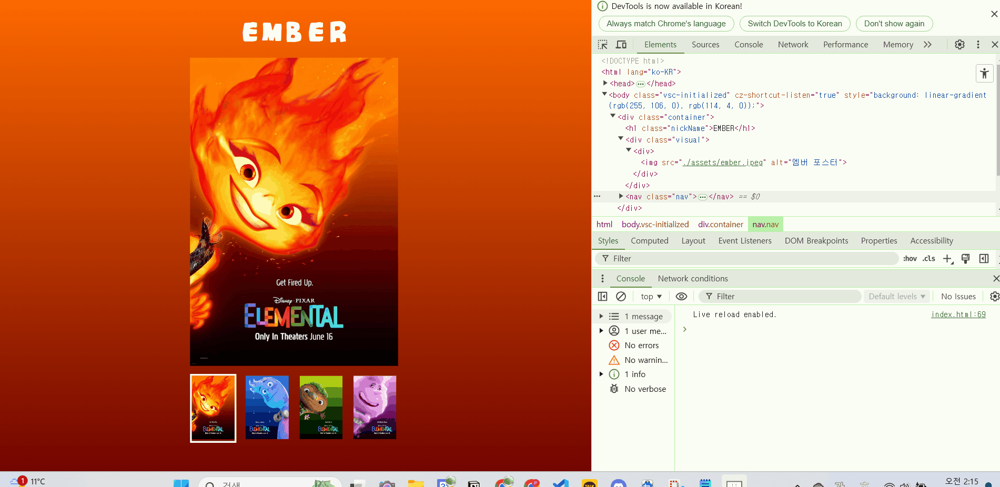

# 🐯 JS Homework 03 🐯

## ✏️문제
**썸네일 이미지를 클릭하면 메인 이미지와 배경이 바뀔 수 있도록 코드 로직을 작성해주세요.**

**설명:** 포스터의 작은 썸네일 이미지를 클릭하면 중앙에 포스터의 이미지가 크게 나타나게 하는 코드를  이벤트 처리 방식을 사용하여 클릭 이벤트를 걸어 작성해보자.

<br/>


## 요구사항

1. 이벤트 처리 방식을 사용하여 클릭 이벤트를 걸어주세요
  - 이벤트 위임
  - 반복문

​
2. 이미지와 색상의 데이터는 `data.js` 에서 불러와주세요.


3. 각 li 항목들을 클릭하면 배경 색상과 메인 비주얼 이미지를 변경해주세요.
 a. 배경색 변경 ( colorB의 기본값은 `#000` 으로 한다 )
 ```html
elem.style.background = `linear-gradient(to bottom, 'colorA','colorB')`;
```
 b. 이미지 변경
```html
target.src = `./assets/${data.name}.jpeg`;
target.alt = data.alt;
```

4. 비주얼이 변경되면 상단에 비주얼에 맞는 이름으로 변경해주세요.
```html
target.textContent = data.name;
```

5. 함수를 분리시켜주세요.
    a. `setBgColor` 함수
    b. `setImage` 함수
    c. `setNameText` 함수


6. 가독성이 좋은 코드로 리팩토링 해주세요.

<br/>


## 1. 내가 작성하기 쉬운 코드로 작성해보기

원래 코드를 작성할 때 특히, 함수를 작성할 때 처음부터 조건에 맞추어서 완벽하게 코드를 작성하려고 하는 습관 때문에 항상 좀 막막하고 갈 길이 멀어보였었는데 우선 범쌤의 말씀처럼 함수의 이름을 정하고, 함수 실행 코드부터 작성 해본 후 일단 원하는 결과물이 나올 수 있게! 그러니까 작동은 하도록 코드를 작성해보았다. 이런식으로 먼저 작동하는 기본적인 기능을 만들고, 이를 차차 개선하는 방식이 좀 더 효과적이라는 걸 깨달았다. 이 방법이 덜 부담스럽고, 더 효율적이게 느껴졌다.


<br/>

## 2. 코드 작성하기

<br/>


### 모듈화 방식으로 작성하기

우선 조건에 포스터의 데이터는 `data.js `에서 받아오라고 하셔서 data를 먼저 `export` 해주고, `main.js`에서 `import`로 불러와줬는데 콘솔창을 보면 계속 에러가 떴다.

아니 잘 못 한게 없는거 같은데 계속 에러가 뜨길래 너무 의아했는데 알고보니 `index.html`에서 스크립트 태그로 `data.js`와 `main.js`를 가져올 때 `type="module"`을 쓰지 않아 생긴 오류였다. module 속성이 없으면 ES6 모듈 방식으로 코드를 불러올 수 없기 때문에 오류가 발생한 거였다. 항상 기본적인 것을 잘 체크하도록 하자..^^


<br/>


### a. 기능 구현

```js
  const buttons = document.querySelectorAll(".nav button");
  const body = document.querySelector("body");
  const visualImg = document.querySelector(".visual img");
  const nickName = document.querySelector(".nickName");


  buttons.forEach((button, index) => {
    button.addEventListener("click", () => {
      const selectedData = data[index]; 


      // 바디 배경 색 변경
      body.style.background = `linear-gradient(to bottom, ${selectedData.color[0]}, ${selectedData.color[1]})`;
      
      // visual 정보 변경
      visualImg.src = `./assets/${selectedData.name.toLowerCase()}.jpeg`; 
      visualImg.alt = selectedData.alt; 
      
      // 이름 변경
      nickName.innerText = selectedData.name; 

      
      // 우선 버튼의 모든 부모 요소에서 'is-active' 클래스를 지워주고, 
      // 버튼이 눌리면 버튼의 부모 요소에 'is-active' class를 추가해준다.
      buttons.forEach((button) => {
        const parent = button.parentElement; 
        parent.classList.remove("is-active"); 
      });
      button.parentElement.classList.add("is-active");
    });
  });
```
처음 작성한 코드는 위와 같다. 

버튼을 클릭할 때 변경줘야하는 요소들은 `querySelector`를 이용하여 각 부분을 잡고, 변경해야 하는 `body`의 `background`부분과 `visual`의 `img`부분, `nickName`부분들의 속성에 직접 접근하여 값을 변경해주는 코드를 작성하였다.  

그리고 위 코드들은 `forEach` 반복문으로 감싸서 각 버튼에 클릭 이벤트를 연결하였다. 각 버튼을 클릭할 때마다 `data` 배열에서 해당하는 인덱스를 확인하여 데이터가 선택되고, 그 데이터 값에 따라 배경색, 이미지, 이름 텍스트가 변경되도록 했다. 

<br>

**`is-active` 클래스 넣고 빼기**

또, 클릭이 된 미니 썸네일은 선택 된 상태라는 것을 보여주기 위해 `border`가 설정 되어 있었는데 이는 `is-active`로 적용 되는 것 이었기 때문에 얘는 따로 빼서 작성해주었다. 

그런데 선택 된 항복에 `is-active`를 넣어주고, 이 전에 `is-active`클래스가 적용되어 있는 것을 찾아 제거해 주는 것 보다 우선, 모든 버튼의 부모 요소에서 `is-active` 클래스를 제거하고, 클릭된 버튼의 부모 요소에 is-active 클래스를 새로 추가해 주는 것이 훨씬 코드가 간단할 것 같아서 `forEach`문을 활용하여 `is-active`클래스를 모두 지우고, 선택 된 항복에 `is-active`클래스를 넣어주도록 코드를 작성하였다.


<br>
<br>

이렇게 해서 일단 작동은 하는 코드를 만들었다. 위와 같이 코드를 작성하여도 미니 썸네일을 누르면 큰 포스터의 이미지와 정보들이 잘 바뀌었다. 그런데 이제 고도화 시킬 시간...!


<br/>
<br/>


### 코드 개선 하기

우선 위 3가지 변경하는 기능을 가진 코드를 모두 함수로 바꾸는 요구사항을 실행했다. 


```js
// 바디 배경 색 변경 함수
function setBgColor(color) {
  bodyElement.style.background = `linear-gradient(to bottom, ${color[0]}, ${color[1]})`;
}


// 이미지 정보 변경 함수
function setImg(element, name, alt) {
  element.src = `./assets/${name.toLowerCase()}.jpeg`;
  element.alt = alt || "이미지 정보가 없습니다";
}


// 이름 변경 함수
function setNameText(element, name) {
  element.innerText = name;
}


// 버튼 클릭 이벤트 적용
buttons.forEach((button, index) => {
  button.addEventListener("click", () => {
    const selectedData = data[index];


    // 함수 실행
    setBgColor(selectedData.color);
    setImg(visualImg, selectedData.name, selectedData.alt);
    setNameText(nickName, selectedData.name);


    // 우선 버튼의 모든 부모 요소에서 'is-active' 클래스를 지워주고,
    // 버튼이 눌리면 버튼의 부모 요소에 'is-active' class를 추가해준다.
    buttons.forEach((button) => {
      const parent = button.parentElement;
      parent.classList.remove("is-active");
    });

    button.parentElement.classList.add("is-active");
  });
}
```

변경된 함수는 위와 같다. 먼저 함수로 만드는 이유는 재사용성을 높이기 위함이기 때문에 함수의 내용 안에는 특정한 부분에서만 사용되는 코드를 모두 매개변수로 받아오는 것으로 처리했다. 

처음에 바디 배경 색을 바꾸는 코드도 함수로 만들 때 element 또한 매개변수로 처리하려고 했는데 범쌤께서 제시해주신 함수 이름이 `setBgColor` 였기 때문에 element까지 매개변수로 받지는 않았다.

이미지 정보 변경 함수에는 alt 값이 없을 때가 혹시 있을까 싶어서 alt 값이 없을 땐 `"이미지 정보가 없습니다"`라는 멘트를 반환하게 하였다. 

<br>
그리고 이 전에 만들어두었던 버튼의 `forEach`문 안에서 만든 함수에 올바른 매개변수들을 넣어주고 함수를 실행시켜 올바른 작동을 할 수 있도록 하였다.


<br/>

<br/>

### 소소한 꾸미기

사실 포스터가 바뀔 때 엠버는 불 효과, 웨이드는 물 효과 같은 효과를 넣고 싶었는데...... 엄... 찾아보니 너무 복잡하고 어려워서 못했고 간단하게 닉네임의 폰트.. 정도만 바꿔 주었다ㅎㅎ

<br/>

## 결과 화면


<br/>


## 느낀점
이번에는 확실히 저번 과제 때 보다 함수를 작성하는데 시간이 더 적게 걸렸다...! 아 이번에는 제공해주신 것이 많아서일까...?ㅎ 아무튼 제대로 동작하는 함수를 잘 작성했다는 것 만으로도 매우 기뻤다. 

그리고 나름? 가독성이 좋은 코드라고 생각하는데.. 다른 분들은 어떻게 보실라나 궁금하다. 얼른 범쌤의 코드도 봐 보고 싶다. 

여행이 껴 있어서 솔직히 못 할줄 알았는데 어떻게.. 되긴 되었다.. 뿌듯하다. 이제 자러 갑니다... 범쌤도 소중한 주말을 써가면서 피드백 해주셔서 감사합니다! 더 열심히 해볼게요(●'◡'●)


